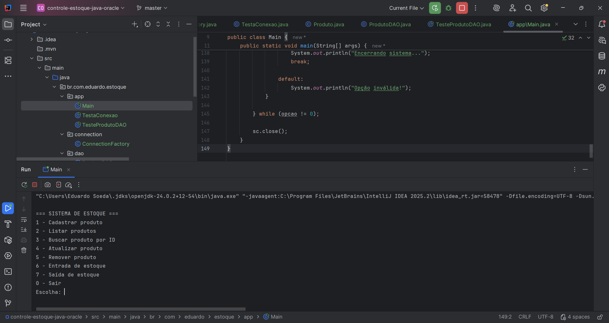
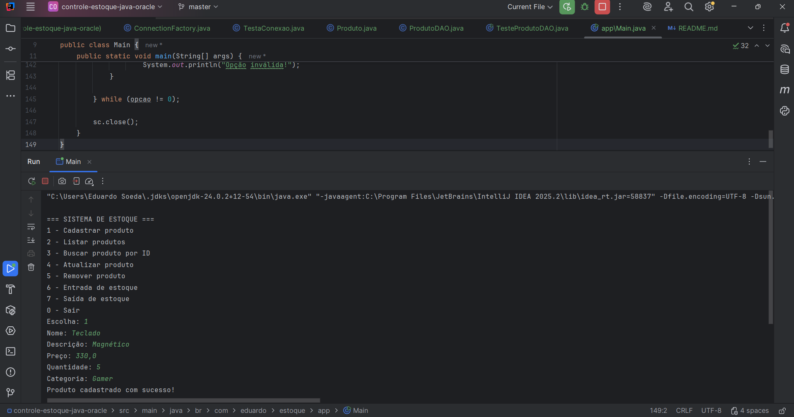
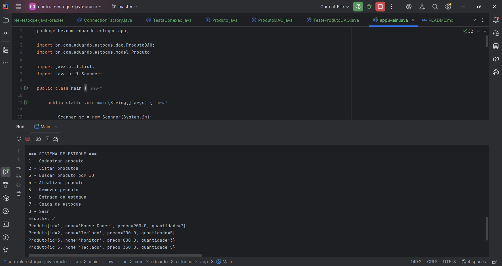

# 🧾 Sistema de Controle de Estoque em Java + Oracle

Este projeto foi desenvolvido com o objetivo de simular um sistema real de controle de estoque, utilizando Java e integração com banco de dados Oracle.

---

## 🚀 Funcionalidades

- Cadastro de produtos
- Listagem de produtos
- Busca de produto por ID
- Atualização de dados do produto
- Remoção de produtos
- Entrada de estoque
- Saída de estoque com validação (não permite estoque negativo)

---

## 🛠️ Tecnologias utilizadas

- Java
- JDBC (Java Database Connectivity)
- Oracle Database (21c XE)
- SQL
- IntelliJ IDEA
- Maven

---

## 📦 Estrutura do projeto

```
src/
└── main/
└── java/
└── br/
└── com/
└── eduardo/
└── estoque/
├── model
│ └── Produto.java
│
├── dao
│ └── ProdutoDAO.java
│
├── connection
│ └── ConnectionFactory.java
│
└── app
├── Main.java
├── TestaConexao.java
└── TesteProdutoDAO.java

```
---

## 📸 Demonstração

### Menu do sistema



### Cadastro de produto



### Listagem de produtos



---

## ▶️ Como executar o projeto

### 1. Instalar o Oracle Database XE

Certifique-se de que o Oracle Database esteja instalado e rodando localmente.

---

### 2. Criar a tabela no banco de dados

Execute o seguinte script SQL:

```sql
CREATE TABLE produto (
    id NUMBER GENERATED ALWAYS AS IDENTITY PRIMARY KEY,
    nome VARCHAR2(100) NOT NULL,
    descricao VARCHAR2(255),
    preco NUMBER(10,2) NOT NULL,
    quantidade NUMBER NOT NULL,
    categoria VARCHAR2(50),
    data_cadastro DATE DEFAULT SYSDATE
);
